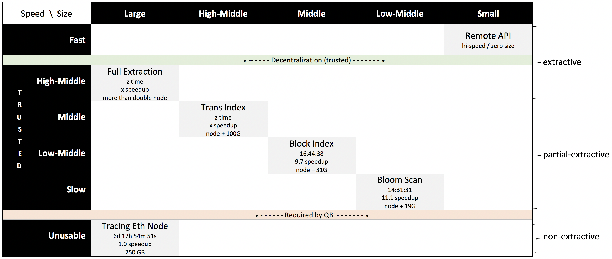

#### Speed vs. Size vs. Decentralization

In the following discussion, we analyze the tradeoffs of obtaining pristine (**provably-true**) data from an Ethereum node across three dimensions: speed vs. size vs. decentralization. We wish to provide application developers with the ability to choose between these three dimenstions all the while preserving the data's integrity with mathematical precision. A sucessful system will admit no comprimise on the accuracy, provability, availability, or accessibility of the data.

##### Decentralization

The first dimension to consider, decentralization, is both the most criticle and the easiest to underestimate. In centralized systems, such as today's third-party APIs, the developer/user must accept that the provider may (a) alter or enhance the data silently (inaccruate and/or non-provable), (b) withhold the data for arbitrary reasons, or (c) limit the amount of data provided (again for arbitrary reasons). In the system we desire, none of these things should be possible. We therefore dismiss today's Web 2.0 API data delivery mechanisms. Below, we discuss methods to recussitate this method using **provably-true data**.

In the above chart, centralized solutions such as EtherScan and open source blockchain explorers live above the pale green line, that is, they are centralized. While these solutions provide fast, low-impact (and very convienient) access to blockchain data, they do not do so in a trusted manner. Few people would argue that closed-source solutions such as EtherScan are to the long-term benefit of the ecosystem, however proponents of the open source blockchain explorer solutions claim that the open-source aspect of these systems is sufficient to ensure accuracy, availability, and accessibility. We argue otherwise.

##### Extractive vs. Non-Extractive Solutions

The Ethereum data is large and growing larger. It is also notoriously difficult to use. Furthermore, as anyone who has tried to directly access the Ethereum node knows, retreival of deep detail is slow. One is presented with a choice: either extract the blockchain's database thereby (at a minimum) doubling the size of the data or extract partial data, thereby requiring less hard drive space at the cost of speed. In the later case, one must devise methods to increase speed of access. This is possible, and this is the path TrueBlocks takes.

All open-source blockchain explorers that we are aware of take the fully-extractive path, thereby removing the ability to make engineering tradeoff between the size of the data vs. its speed. The open-source aspect of these solutions promises to alliviate the trustability issue (i.e. in this sense it crosses the green line above), but because of the choice to be fully extractive it does not admit solutions that require a smaller impact. Over time, due to the quickly growing nature of the blockchain, this doubling of the size of the data will make it all but impossible for anyone other than those with resources to particiapte in decentralized data.

We next explore levels of extraction one may choose and the implications of the same.
